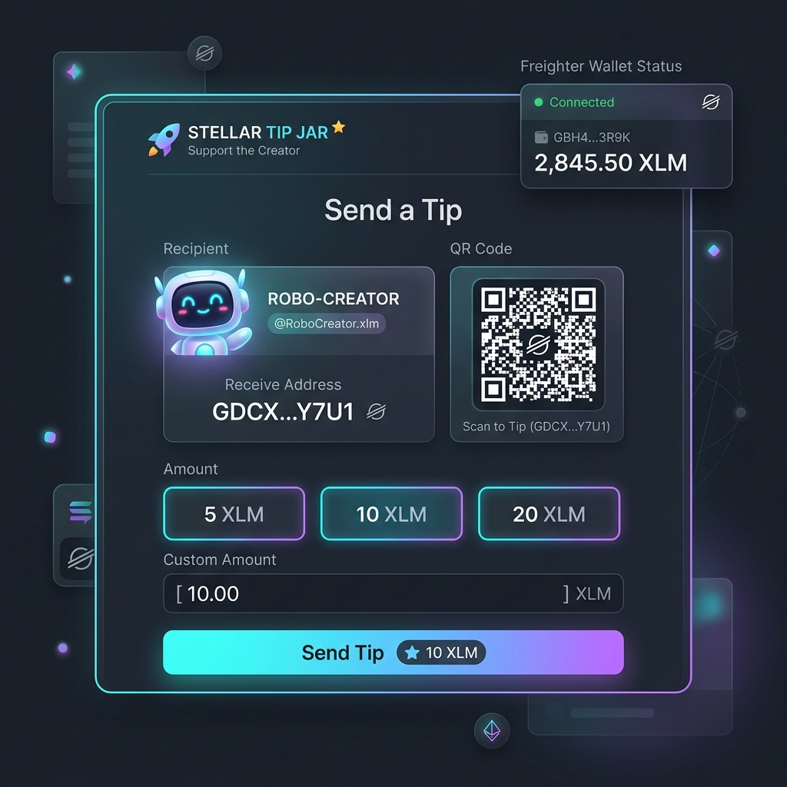
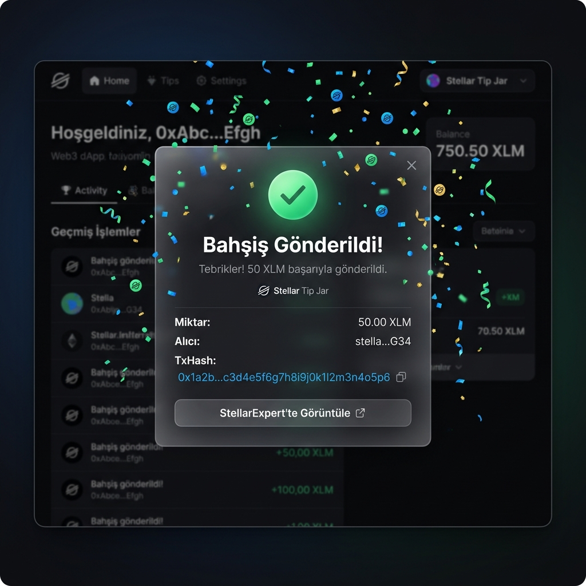

# Stellar Tip Jar & QR Generator

[English](#english) | [Türkçe](#türkçe)

---

## English

A premium, modern Web3 dApp for sending tips (XLM) on the **Stellar Testnet** using the **Freighter Wallet**. This project fully satisfies the requirements of **Stellar White Belt (Level 1)**.

### 🚀 Features
- **Wallet Connection:** Connect and disconnect Freighter wallet.
- **Balance Handling:** Fetch and display real-time XLM balance of the connected wallet using Horizon API.
- **Transaction Flow:** Send XLM tips on Stellar Testnet, requesting signature authorization via Freighter.
- **Multilingual Support:** Switch between English (EN) and Turkish (TR) dynamically in the UI.
- **Dynamic URL Parameter:** Share a personalized tip link via `?addr=<stellar_address>` to automatically lock the recipient.
- **Identicon Avatar:** Dynamically generate robot profile avatars using Robohash based on the recipient address.
- **QR Code Generator:** View and scan the recipient's address QR code for mobile payments.
- **Friendbot (Faucet):** Request 10,000 XLM from the Testnet Faucet with one click if the account balance is 0.

### 📸 Screenshots

#### 1. Wallet Connected & Balance Displayed
When the Freighter wallet connects, the address and balance are displayed in the navbar. A custom robot avatar and address QR code are generated for the recipient.



#### 2. Successful Transaction & Feedback
On success, a celebration confetti animation is triggered, and a Status Modal displays the transaction receipt/hash with a link to StellarExpert.



### 🛠️ Setup Instructions (Local Run)

Follow these steps to run the application locally:

#### Prerequisites
- Node.js (v18+) and npm installed.
- [Freighter Wallet](https://www.freighter.app/) extension installed on your browser and set to **Test Net**.

#### Installation Steps

1. Clone the repository and navigate into the folder:
   ```bash
   git clone <repo-url>
   cd steller_white_belt
   ```

2. Install all dependencies:
   ```bash
   npm install
   ```

3. Launch the Vite local dev server:
   ```bash
   npm run dev
   ```

4. Open `http://localhost:5173` in your browser.

#### Testing Personalized Page
To test the page with a prefilled address, append your testnet address to the URL:
`http://localhost:5173/?addr=GYOURSTELLARTESNETADDRESSHERE`

---

## Türkçe

**Stellar Testnet** üzerinde **Freighter cüzdanı** aracılığıyla bahşiş (XLM) gönderilmesini sağlayan premium ve modern bir Web3 dApp uygulamasıdır. Bu proje, **Stellar White Belt (Level 1)** gereksinimlerini eksiksiz karşılamaktadır.

### 🚀 Özellikler
- **Cüzdan Bağlantısı (Wallet Connection):** Freighter cüzdanı ile hızlı bağlantı kurma ve cüzdan bağlantısını kesme (Disconnect) özelliği.
- **Bakiye Sorgulama (Balance Handling):** Horizon API ile bağlı cüzdanın güncel XLM bakiyesini gerçek zamanlı sorgulama ve ekranda gösterme.
- **Bahşiş Gönderme Sistemi (Transaction Flow):** Testnet üzerinde alıcı adresine anlık XLM transferi gerçekleştirme ve imzalanması için Freighter cüzdanını tetikleme.
- **Çift Dil Desteği:** Arayüz üzerinden dinamik olarak İngilizce (EN) ve Türkçe (TR) dilleri arasında geçiş yapabilme.
- **URL Parametre Desteği:** `?addr=<stellar_adresi>` biçimiyle alıcı adresini kilitleyip kişiselleştirilmiş bahşiş sayfası paylaşabilme.
- **Dinamik Avatar:** Robohash ile cüzdan adresine özel benzersiz ve sevimli robot profil resimleri.
- **QR Kod Oluşturucu:** Alıcı cüzdan adresini mobil tarayıcılar ve cüzdanlar için QR kod formatında otomatik sunma.
- **Friendbot (Testnet Faucet):** Bakiyesi 0 olan bağlı hesaplar için tek tıkla testnet XLM talep edebilme.

### 📸 Ekran Görüntüleri

#### 1. Cüzdan Bağlantı ve Bakiye Gösterim Durumu
Cüzdan Freighter üzerinden bağlandığında, sağ üst köşede cüzdan adresi ve güncel XLM bakiyesi dinamik olarak görüntülenir. Alıcı cüzdanı için Robohash avatarı ve QR kod otomatik oluşturulur.


#### 2. Başarılı İşlem ve Sonuç Bildirimi
Bahşiş başarıyla gönderildiğinde arayüzde bir tebrik animasyonu (konfeti) tetiklenir ve işlem sonucunu/özetini gösteren makbuz ekranı (Status Modal) açılır. StellarExpert bağlantısı ile işlem doğrulanabilir.


### 🛠️ Yerel Kurulum & Çalıştırma (Setup Instructions)

Projeyi yerel bilgisayarınızda çalıştırmak için aşağıdaki adımları sırasıyla uygulayın:

#### Gereksinimler
- Node.js (v18+) ve npm yüklü olmalıdır.
- Tarayıcınızda [Freighter Wallet](https://www.freighter.app/) uzantısı kurulu ve **Testnet** ağına ayarlanmış olmalıdır.

#### Kurulum Adımları

1. Bu depoyu klonlayın ve proje dizinine girin:
   ```bash
   git clone <depo-adresi>
   cd steller_white_belt
   ```

2. Gerekli tüm bağımlılıkları yükleyin:
   ```bash
   npm install
   ```

3. Yerel geliştirici sunucusunu (Vite) başlatın:
   ```bash
   npm run dev
   ```

4. Tarayıcınızdan `http://localhost:5173` adresine gidin.

#### Kişisel Bahşiş Sayfanızı Test Etme
Uygulamayı kendi cüzdan adresiniz için açmak isterseniz tarayıcıdaki URL'in sonuna adresinizi parametre olarak ekleyin:
`http://localhost:5173/?addr=GYOURSTELLARTESNETADDRESSHERE`